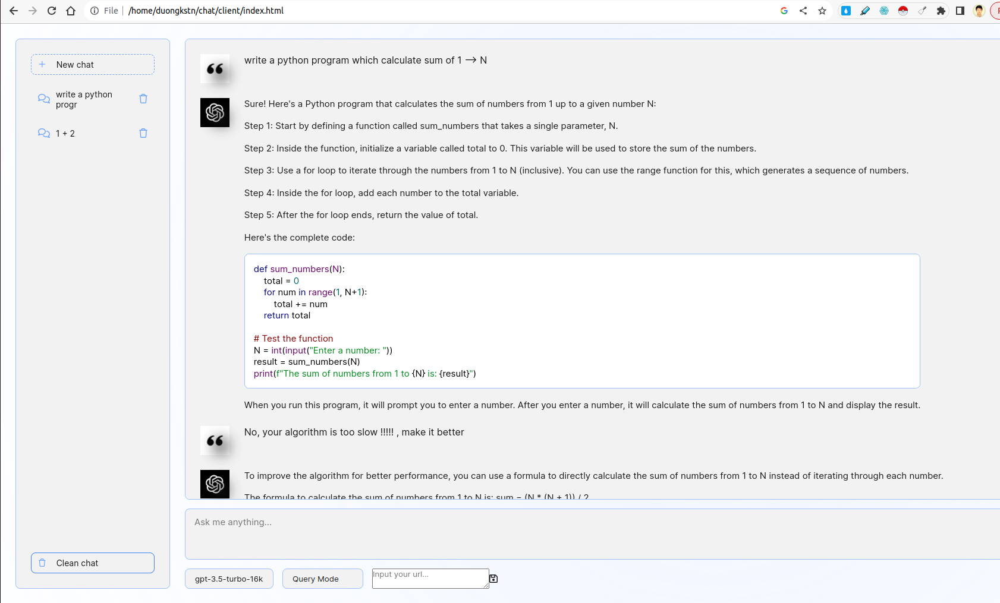
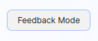
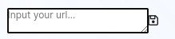
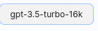
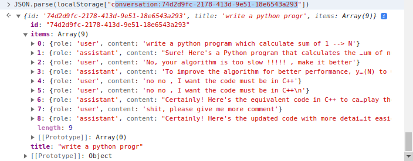

# Code Supporter

This project aims to leverage Large Language Model capabilities to support coding.

## Overview
The system includes client and server. On client side, there are various interesting features including Snippet Management, basic chatbot interface, choosing models, choosing Query or Feedback mode. On server side, the logic of Query / Feedback is implemented, futhermore, FastAPI is used to interact with ChatGPT APIs.




## Core Features
### 1. Web Interface for Code Generation:
> - Develop a user-friendly web interface using FastAPI or Flask that prompts users to input a description of their coding problem.
> - The interface should interact with an LLM to generate a corresponding code snippet based on the user’s input.

The front-end is inspried from ChatGPT UI. It interacts with back-end by using websocket. In more details, the front-end takes a user query and transmit it to server by websocket. Server will get result from ChatGPT by FastAPI streaming mode and then forward to client.

### 2. Feedback Loop for Improvement:
> - Incorporate a featuare that allows users to provide feedback on the generated code snippets.
> - Utilize this feedback to refine future generations.

Here, there are two options Query mode and Feedback mode. In Query mode, coding prompt is used by Chain-of-Thought prompting technique. In Feedback mode, feedback prompt is used to refine user's negative feedbacks by Few-Shot prompting technique (see file `server/prompts.py`).

To switch between two modes, you can choose options like below:



### 3. Custom LLM Integration:
> - Develop scripts for running and utilizing a custom LLM either locally or on a GPU server.

In `custom_llm` folder, there is a script to run custom llm by `vllm`. You can input your url to UI and click save:


In addition, you can choose model you want from options below the input text box.


### 4. Containerization:
> - Provide a Dockerfile along with instructions for building and running the application as a container

The project supports building services by Dockerfile(s).
To run client webpage docker container, run:
```
cd client/
sudo docker build -t code-supporter-client:latest .
sudo docker run -d -p 8000:80 code-supporter-client:latest
```

On the other hand, run server docker container as follows:
```
cd server/
sudo docker build -t code-supporter-server:latest .
sudo docker run -p 7999:80 -e OPENAI_API_KEY=sk-... code-supporter-server:latest
```

To simplify, you can run client and server by just one command (please change the `OPENAI_API_KEY` in `docker-compose.yml`):
```
sudo docker compose up
```

After all, go to url `http://localhost:8000/` on browser to start chatting !

### 5. Snippet Management:
> - Implement functionality within the same interface to display a list of previously generated code snippets.
> - Users should be able to view, review, and delete these snippets

The client side implements snippet management where `localStorage` of client is used.
In more details, `localStorage` is a dictionary where key is `conversation_id`, the value is converstions in multiple turns.
Example a conversation:




## Folder structure
There are two main folders, `client` and `server`. While first one includes html/css/javascript code to render the code supporter webpage, the later contains server code written in Python.

In `client` folder, the most imporant code is `js/chat.js` file, where it handles the logic of server/client iteraction
In `server` folder, the usage of files as follows:
- `apps.py`: serving FastAPI
- `routers`: handle FastAPI websocket requests and iteract with client side
- `prompts.py`: declare prompts
- `utils.py`: some supportive functions
